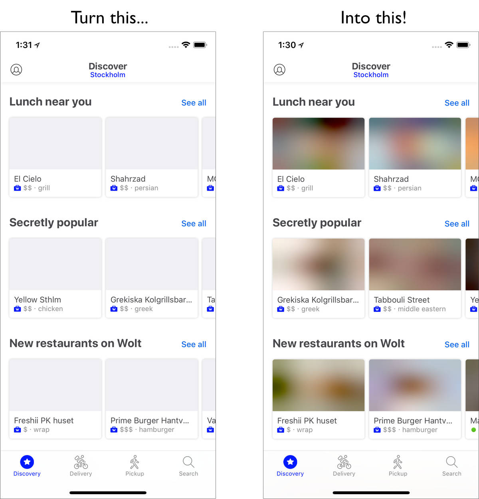

# BlurHash

BlurHash is a compact representation of a placeholder for an image.

## Why would you want this?

Does your designer cry every time you load their beautifully designed screen, and it is full of empty boxes because all the
images have not loaded yet? Does your database engineer cry when you want to solve this by trying to cram little thumbnail
images into your data to show as placeholders?

BlurHash will solve your problems! How? Like this:

## How does it work

In short, BlurHash takes an image, and gives you a short string (only 20-30 characters!) that represents the placeholder for this
image. You would do this on the backend of your service, and store the string along the image. When you send data to your
client, you send both the URL to the image, and the BlurHash string. Your client then takes the string, and decodes it into an
image that it shows while the real image is loading over the network. The string is short enough that comfortably fits in with
whatever data format you use. For instance, it can easily be added as a field in a JSON object.

In summary:

&nbsp;&nbsp;&nbsp;

Want to know all the gory technical details? Read the [algorithm description](Algorithm.md).

Implementing the algorithm is actually quite easy! Implementations are short and easily ported to your favourite language or
platform.

## Implementations

So far, we have created these implementations:

* [C](C) - A simple encoder implemenation in portable C code.
* [Swift](Swift) - Simple encoder and decoder implementations, and a larger library offering advanced features.
  There is also an example app to play around with the algorithm.
* [Kotlin](Kotlin) - A simple decoder implementation for Android.
* [TypeScript](TypeScript) - A simple decode implementation.
* [Python](Python) - Integration of the C encoder code into Python.

These cover our use cases, but could probably use polishing, extending and improving. Perhaps you'd like to help?
Which brings us to...

## Contributing

We'd love contributions! The algorithm is [very simple](Algorithm.md) - less than two hundred lines of code - and can easily be
ported to your platform of choice. And having support for more platforms would be wonderful! So, Java decoder? Golang encoder?
Haskell? Rust? We want them all!

We will also try to tag any issues on our [issue tracker](https://github.com/woltapp/blurhash/issues) that we'd love help with, so if you just want to dip in, go have a look.

You can file a pull request with us, or you can start your own repo and project if you want to run everything yourself, we don't mind.

If you do want to contribute to this project, we have a [code of conduct](CodeOfConduct.md).

## Good Questions

### How fast is encoding? Decoding?

The implementations here are not very optimised. Running them on very large images can be a bit slow. The performance of
the encoder and decoder is about the same for the same input or output size, so decoding very large placeholders, especially
on your UI thread, can be a bit slow.

However! The trick to using the algorithm correctly is to not run it on full-sized data. The fine detail of an image is all thrown away,
so you should scale your images down before running BlurHash on them. If you are creating thumbnails, run BlurHash on those
instead of the full images.

Similarly, when displaying the placeholders, very small images scaled work very well. We usually decode placeholders that are
32 or even 20 pixels wide, and then let the UI layer scale them up, which is indistinguishable from decoding them at full size.

### How do I pick the number of X and Y components?

It depends a bit on taste. The more components you pick, the more information is retained in the placeholder, but the longer
the BlurHash string will be. Also, it doesn't always look good with too many components. We usually go with 4 by 3, which
seems to strike a nice balance.

However, you should adjust the number of components depending on the aspect ratio of your images. For instance, very wide
images should have more X components and fewer Y components.

## Authors

* [Dag Ågren](https://github.com/DagAgren) - Original algorithm design, Swift and C implementations
* [Mykhailo Shchurov](https://github.com/shchurov) - Kotlin decoder implementation
* [Olli Mahlamäki](https://github.com/omahlama) - TypeScript decoder implemenation
* [Atte Lautanala](https://github.com/lautat) - Python integration
* _Your name here?_

## License

All of these implemenations are licensed under the MIT license:

Copyright (c) 2018 Wolt Enterprises

Permission is hereby granted, free of charge, to any person obtaining a copy
of this software and associated documentation files (the "Software"), to deal
in the Software without restriction, including without limitation the rights
to use, copy, modify, merge, publish, distribute, sublicense, and/or sell
copies of the Software, and to permit persons to whom the Software is
furnished to do so, subject to the following conditions:

The above copyright notice and this permission notice shall be included in all
copies or substantial portions of the Software.

THE SOFTWARE IS PROVIDED "AS IS", WITHOUT WARRANTY OF ANY KIND, EXPRESS OR
IMPLIED, INCLUDING BUT NOT LIMITED TO THE WARRANTIES OF MERCHANTABILITY,
FITNESS FOR A PARTICULAR PURPOSE AND NONINFRINGEMENT. IN NO EVENT SHALL THE
AUTHORS OR COPYRIGHT HOLDERS BE LIABLE FOR ANY CLAIM, DAMAGES OR OTHER
LIABILITY, WHETHER IN AN ACTION OF CONTRACT, TORT OR OTHERWISE, ARISING FROM,
OUT OF OR IN CONNECTION WITH THE SOFTWARE OR THE USE OR OTHER DEALINGS IN THE
SOFTWARE.
