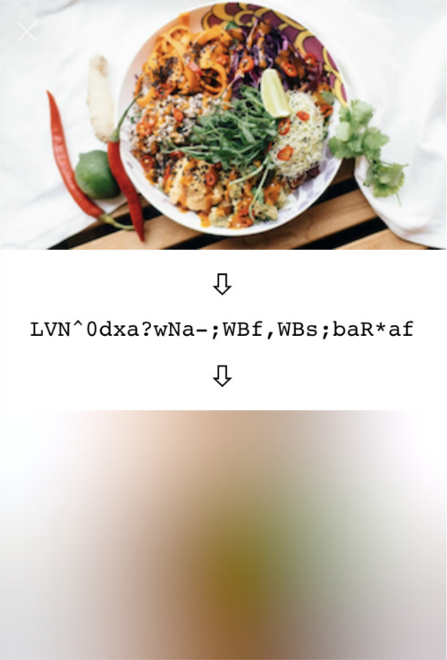
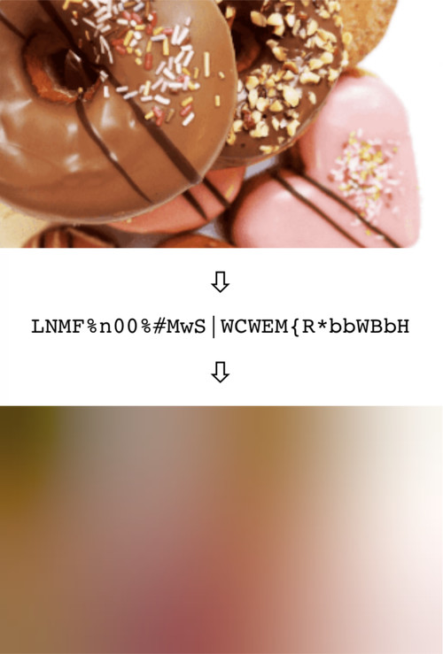

# [BlurHash](http://blurha.sh)

BlurHash is a compact representation of a placeholder for an image.

## Why would you want this?

Does your designer cry every time you load their beautifully designed screen, and it is full of empty boxes because all the
images have not loaded yet? Does your database engineer cry when you want to solve this by trying to cram little thumbnail
images into your data to show as placeholders?

BlurHash will solve your problems! How? Like this:

You can also see nice examples and try it out yourself at [blurha.sh](http://blurha.sh/)!

## How does it work?

In short, BlurHash takes an image, and gives you a short string (only 20-30 characters!) that represents the placeholder for this
image. You do this on the backend of your service, and store the string along with the image. When you send data to your
client, you send both the URL to the image, and the BlurHash string. Your client then takes the string, and decodes it into an
image that it shows while the real image is loading over the network. The string is short enough that it comfortably fits into
whatever data format you use. For instance, it can easily be added as a field in a JSON object.

In summary:

&nbsp;&nbsp;&nbsp;

Want to know all the gory technical details? Read the [algorithm description](Algorithm.md).

Implementing the algorithm is actually quite easy! Implementations are short and easily ported to your favourite language or
platform.

## Implementations

So far, we have created these implementations:

* [C](C) - An encoder implementation in portable C code.
* [Swift](Swift) - Encoder and decoder implementations, and a larger library offering advanced features.
  There is also an example app to play around with the algorithm.
* [Kotlin](Kotlin) - A decoder implementation for Android.
* [TypeScript](TypeScript) - Encoder and decoder implementations, and an example page to test.
* [Python](https://github.com/woltapp/blurhash-python) - Integration of the C encoder code into Python.

These cover our use cases, but could probably use polishing, extending and improving. There are also these third party implementations that we know of:

* [Pure Python](https://github.com/halcy/blurhash-python) - Implementation of both the encoder and decoder in pure Python.
* [One version in Go](https://github.com/bbrks/go-blurhash), and [another version in Go](https://github.com/buckket/go-blurhash).
* [PHP](https://github.com/kornrunner/php-blurhash) - Encoder and decoder implementations in pure PHP.
* [Java](https://github.com/hsch/blurhash-java) - Encoder implementation in Java.
* [Clojure](https://github.com/siili-core/blurhash) - Encoder and decoder implementations in Clojure.
* [Nim](https://github.com/SolitudeSF/blurhash) - Encoder and decoder implementation in pure Nim.
* [Rust and WebAssembly](https://github.com/fpapado/blurhash-rust-wasm) - Encoder and decoder implementations in Rust. Distributed as both native Rust and WebAssembly packages.
* [Ruby](https://github.com/Gargron/blurhash) - Encoder implementation in Ruby.
* [Crystal](https://github.com/Sija/blurhash.cr) - Encoder implementation in pure Crystal.
* [Elm](https://github.com/WhileTruu/elm-blurhash) - Encoder and decoder in Elm.
* [Dart](https://github.com/folksable/blurhash_ffi) - Encoder and decoder implementation in C into Dart using dart-ffi.
* [Pure Dart](https://github.com/justacid/blurhash-dart) - Encoder and decoder implementation in pure Dart.
* [.NET](https://github.com/MarkusPalcer/blurhash.net) - Encoder and decoder in C#.
* [JavaScript](https://github.com/Dens49/blurhash-js) - Encoder and decoder implementation in pure JavaScript.
* [.NET](https://github.com/Bond-009/BlurHashSharp) - Encoder implementation in C#.
* [Haskell](https://github.com/SamProtas/JuicyPixels-blurhash) - Encoder and decoder in pure Haskell.
* [Scala](https://github.com/markussammallahti/blurhash-scala) - Encoder and decoder in Scala.
* [Elixir](https://github.com/perzanko/blurhash-elixir) - Encoder implementation in pure Elixir.
* [ReScript](https://github.com/armedi/rescript-blurhash) - Encoder and decoder implementation in ReScript (BuckleScript).
* [JavaScript](https://github.com/mad-gooze/fast-blurhash) - Tiny optimized decoder implementation JS.
* [Xojo](https://github.com/piradoiv/xojo-blurhash/) - Encoder and decoder implementation in pure Xojo.
* [React Native](https://github.com/mrousavy/react-native-blurhash) - UI Component for React Native. (Decoder in Swift and Kotlin)
* [Zig](https://github.com/mhoward540/blurhash-zig) - Encoder implementation in Zig.
* [Titanium SDK](https://github.com/m1ga/ti.blurhash) - Decoder for Titanium SDK (Android)
* [BQN](https://github.com/dancek/blurhash-bqn) - Encoder, decoder and terminal viewer in pure BQN.
* [Jetpack Compose](https://github.com/wajahat-iqbal/BlurHashPainter) - Decoder Jetpack Compose implementation
* [C++](https://github.com/Nheko-Reborn/blurhash) - Encoder and decoder in C++.
* [Kotlin Multiplatform](https://github.com/vanniktech/blurhash) - Encoding & decoding for Android, iOS & JVM
* [OCaml](https://github.com/ushitora-anqou/ocaml-blurhash) - Encoder implementation in OCaml.

Can't find the language you're looking for? Try your luck with the GitHub search. For example, here are the search results for [repos which have "blurhash" in their name](https://github.com/search?q=blurhash+in%3Aname&type=repositories).

Perhaps you'd like to help extend this list? Which brings us to...

## Contributing

We'd love contributions! The algorithm is [very simple](Algorithm.md) - less than two hundred lines of code - and can easily be
ported to your platform of choice. And having support for more platforms would be wonderful! So, Java decoder? Golang encoder?
Haskell? Rust? We want them all!

We will also try to tag any issues on our [issue tracker](https://github.com/woltapp/blurhash/issues) that we'd love help with, so
if you just want to dip in, go have a look.

You can file a pull request with us, or you can start your own repo and project if you want to run everything yourself, we don't mind.

If you do want to contribute to this project, we have a [code of conduct](CodeOfConduct.md).

## Users

Who uses BlurHash? Here are some projects we know about:

* [Wolt](http://wolt.com/) - We are of course using it ourselves. BlurHashes are used in the mobile clients on iOS and Android, as well as on the web, as placeholders during image loading.
* [Mastodon](https://github.com/tootsuite/mastodon) - The Mastodon decentralised social media network uses BlurHashes both as loading placeholders, as well as for hiding media marked as sensitive.
* [Signal](https://signal.org/) - Signal Private Messenger uses Blurhashes as placeholders before photo & video messages are downloaded in chat conversations.
* [Jellyfin](https://jellyfin.org/) - Jellyfin the free software media system uses Blurhashes as placeholders for images of movies and TV shows when they are being downloaded.

## Good Questions

### How fast is encoding? Decoding?

These implementations are not very optimised. Running them on very large images can be a bit slow. The performance of
the encoder and decoder are about the same for the same input or output size, so decoding very large placeholders, especially
on your UI thread, can also be a bit slow.

However! The trick to using the algorithm efficiently is to not run it on full-sized data. The fine detail of an image is all thrown away,
so you should scale your images down before running BlurHash on them. If you are creating thumbnails, run BlurHash on those
instead of the full images.

Similarly, when displaying the placeholders, very small images work very well when scaled up. We usually decode placeholders
that are 32 or even 20 pixels wide, and then let the UI layer scale them up, which is indistinguishable from decoding them at full size.

### How do I pick the number of X and Y components?

It depends a bit on taste. The more components you pick, the more information is retained in the placeholder, but the longer
the BlurHash string will be. Also, it doesn't always look good with too many components. We usually go with 4 by 3, which
seems to strike a nice balance.

However, you should adjust the number of components depending on the aspect ratio of your images. For instance, very wide
images should have more X components and fewer Y components.

The Swift example project contains a test app where you can play around with the parameters and see the results.

### What is the `punch` parameter in some of these implementations?

It is a parameter that adjusts the contrast on the decoded image. 1 means normal, smaller values will make the effect more subtle,
and larger values will make it stronger. This is basically a design parameter, which lets you adjust the look.

Technically, what it does is scale the AC components up or down.

### Is this only useful as an image loading placeholder?

Well, that is what it was designed for originally, but it turns out to be useful for a few other things:

* Masking images without having to use expensive blurs - [Mastodon](http://github.com/tootsuite/mastodon) uses it for this.
* The data representation makes it quite easy to extract colour averages of the image for different areas. You can easily find approximations of things like the average colour of the top edge of the image, or of a corner. There is some code in the Swift BlurHashKit implementation to experiment with this. Also, the average colour of the entire image is just the DC component and can be decoded even without implementing any of the more complicated DCT stuff.
* We have been meaning to try to implement tinted drop shadows for UI elements by using the BlurHash and extending the borders. Haven't actually had time to implement this yet though.

### Why base 83?

First, 83 seems to be about how many low-ASCII characters you can find that are safe for use in all of JSON, HTML and shells.

Secondly, 83 * 83 is very close to, and a little more than, 19 * 19 * 19, making it ideal for encoding three AC components in two
characters.

### What about using the full Unicode character set to get a more efficient encoding?

We haven't looked into how much overhead UTF-8 encoding would introduce versus base 83 in single-byte characters, but
the encoding and decoding would probably be a lot more complicated, so in the spirit of minimalism BlurHash uses the simpler
option. It might also be awkward to copy-paste, depending on OS capabilities.

If you think it can be done and is worth it, though, do make your own version and show us! We'd love to see it in action.

### What about other basis representations than DCT?

This is something we'd *love* to try. The DCT looks quite ugly when you increase the number of components, probably because
the shape of the basis functions becomes too visible. Using a different basis with more aesthetically pleasing shape might be
a big win.

However, we have not managed come up with one. Some experimenting with a [Fourier-Bessel base](https://en.wikipedia.org/wiki/Fourier–Bessel_series),
targeted at images that are going to be cropped into circles has been done, but without much success. Here again we'd love
to see what you can come up with!

## Authors

* [Dag Ågren](https://github.com/DagAgren) - Original algorithm design, Swift and C implementations
* [Mykhailo Shchurov](https://github.com/shchurov) - Kotlin decoder implementation
* [Hang Duy Khiem](https://github.com/hangduykhiem) - Android demo app
* [Olli Mahlamäki](https://github.com/omahlama) - TypeScript decoder and encoder implementations
* [Atte Lautanala](https://github.com/lautat) - Python integration
* [Lorenz Diener](https://github.com/halcy) - Pure Python implementation
* [Boris Momčilović](https://github.com/kornrunner) - Pure PHP implementation
* [Hendrik Schnepel](https://github.com/hsch) - Java encoder implementation
* [Tuomo Virolainen](https://github.com/tvirolai) - Clojure implementation
* [Fotis Papadogeorgopoulos](https://github.com/fpapado) - Rust and WebAssembly implementation
* [Sam Protas](https://github.com/SamProtas) - Pure Haskell implementation
* [Markus Sammallahti](https://github.com/markussammallahti) - Scala implementation
* [Kacper Perzankowski](https://github.com/perzanko) - Elixir encoder implementation
* [Belvi Nosakhare](https://github.com/KingsMentor/BlurHashExt) - Kotlin extensions of Blurhash for ImageView, Glide, and Piccasso optimized for Android.
* [Armedi](https://github.com/armedi) - ReScript (BuckleScript) implementation.
* [Ricardo Cruz](https://github.com/piradoiv) - Xojo implementation.
* [Marc Rousavy](https://github.com/mrousavy) - React Native UI Component
* [Matt Howard](https://github.com/mhoward540) - Zig implementation
* [Hannu Hartikainen](https://github.com/dancek) - BQN implementation
* [Wajahat Iqbal](https://github.com/wajahat-iqbal) - Jetpack compose-based implementation optimized for using any component as a painter.

* _Your name here?_
